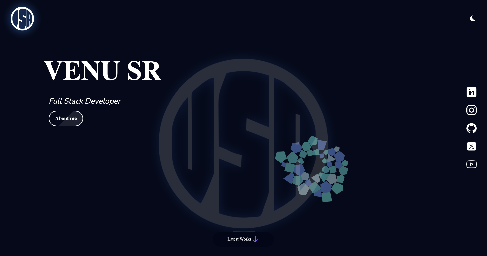

# tailwind_portfolio

# 🌐 Venugopal SR Portfolio  

Welcome to my personal portfolio built with **Tailwind CSS**! 🚀  

  

## 👋 About Me  
Hi, I'm **Venugopal SR** — a passionate **AI & ML Engineer** and a **Full Stack Developer**. I love creating clean and responsive websites, building machine learning models, and working on innovative projects.  

---

## 🌟 Skills  
✅ **Frontend:** HTML, CSS, JavaScript, React, Tailwind CSS  
✅ **Backend:** Python, Django  
✅ **Database:** MySQL  
✅ **AI/ML:** TensorFlow, PyTorch  
✅ **Tools:** Git, VSCode, Figma  

---

## 🚀 Projects  
🎯 **Sign Language Detection** – A real-time sign language interpreter using deep learning.  
🎯 **Hand Gesture Classification** – A model that classifies right hand, left hand, and both hands separately.  
🎯 **DXF File Processor** – Extracts and processes DXF files using Python.  
🎯 **Instagram Post Data Scraper** – Automates data extraction and saves it to Excel.  

---

## 📫 Connect With Me  
  
  
  

---

💻 Built with ❤️ using **Tailwind CSS**  
🌟 **Open to work** | 🌍 **Let's build something awesome together!**  

---

✅ Add the `./assets/websitimg1.jpg` file to your repository so it appears correctly. Let me know if you want to adjust anything! 😎
